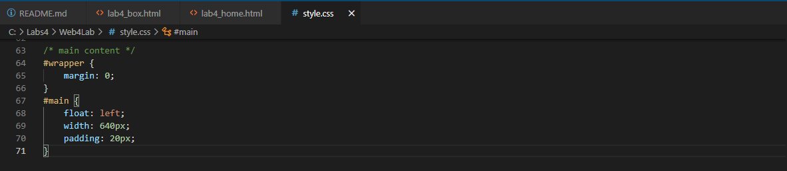

# Web4Lab

### Nama: Dimas Riyadh Alfajri
### Kelas: TI.20.A1
### Nim: 312010029

# Praktikum 4 : Css Layout
## Langkah-Langkah

Persiapan membuat dokumen HTML dengan nama file lab4_box.html seperti berikut.

### Membuat Box

Kemudian tambahkan kode untuk membuat box element dengan tag div seperti berikut.

### CSS Float Property

Selanjutnya tambahkan deklarasi CSS pada head untuk membuat float element, seperti berikut.

Kemudian buka browser untuk melihat hasilnya

Lakukan eksperimen terhadap penggunaan property clear dengan nilai lainnya (left, both, right), lalu simak dan amati perubahannya.

### Membuat Layout Sederhana

Buat folder baru dengan nama lab4_layout, kemudia buatlah file baru didalamnya dengan nama home.html dan file css dengan nama style.css, kemudian tulis kode berikut.

Kemudian buka browser dan lihat hasilnya.

Kemudian tambahkan kode CSS untuk membuat layoutnya.

Kemudian mengatur navigasi nya :

Kemudian lihat hasilnya.

### Membuat Hero Panel

Selanjutnya membuat hero panel. Tambahkan kode HTML dan CSS seperti berikut.

Dan hasilnya

### Mengatur Layout Main dan Sidebar

Selanjutnya mengatur main content dan sidebar, tambahkan CSS float.

### Membuat Sidebar Widget

Kemudian selanjutnya menambahkan element lain dalam sidebar.

Kemudian tambahkan CSS.

Dan liat hasilnya

